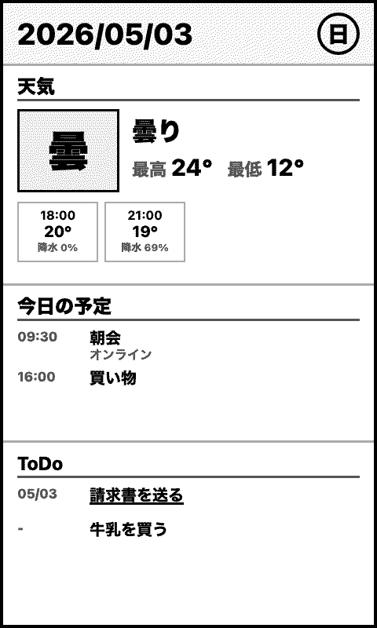

# Inkcross Dashboard

E-ink 端末向けのダッシュボード画像を生成・配信する FastAPI サーバです。

端末は `/dashboard.bmp` にアクセスするだけで、天気・今日の予定・未完了 ToDo をまとめた 480x800 の 4 階調グレースケール BMP を取得できます。



## Features

- 480x800 縦画面の E-ink 端末向けダッシュボード生成
- 気象庁 JSON による東京地方の天気予報表示
- `data/calendar.json` から今日の予定を読み込み
- `data/todo.json` から未完了 ToDo を読み込み
- カレンダーと ToDo の取得・追加・全リフレッシュ API
- Playwright で HTML をレンダリングし、Pillow で 4 階調 BMP に変換
- 端末側で扱いやすい固定 URL の画像配信

詳細な仕様は [SPEC.md](./SPEC.md) を参照してください。

## Requirements

- Python 3.13
- uv
- Playwright Chromium

依存パッケージは `pyproject.toml` と `uv.lock` で管理しています。

## Setup

```bash
uv sync
uv run playwright install chromium
```

## Run

```bash
uv run python main.py
```

デフォルトでは `0.0.0.0:8080` で起動します。
ポート番号を変える場合は `--port` で指定します。

```bash
uv run python main.py --port 9000
```

## API

### `GET /dashboard.bmp`

ダッシュボード画像を BMP 形式で返します。

- `Content-Type`: `image/bmp`
- サイズ: 480x800
- 色数: 4 階調グレースケール
- キャッシュ: `Cache-Control: no-store`

例:

```bash
curl -o dashboard.bmp http://localhost:8080/dashboard.bmp
```

### `GET /health`

ヘルスチェック用エンドポイントです。

```json
{"status": "ok"}
```

### Calendar API

`data/calendar.json` を読み書きします。日付で絞り込まず、保存されている全件を扱います。

#### `GET /calendar`

カレンダー項目を全件取得します。

```bash
curl http://localhost:8080/calendar
```

#### `POST /calendar/add`

カレンダー項目を 1 件追加します。レスポンスは追加後の全件です。

```bash
curl -X POST http://localhost:8080/calendar/add \
  -H 'Content-Type: application/json' \
  -d '{"title":"チームMTG","start":"2026-05-03T14:00:00","end":"2026-05-03T15:00:00","location":"オンライン"}'
```

#### `POST /calendar/refresh`

カレンダー項目を配列全体で置き換えます。レスポンスは置き換え後の全件です。

```bash
curl -X POST http://localhost:8080/calendar/refresh \
  -H 'Content-Type: application/json' \
  -d '[{"title":"朝会","start":"2026-05-03T09:30:00","end":"2026-05-03T10:00:00","location":"オンライン"}]'
```

### ToDo API

`data/todo.json` を読み書きします。完了状態で絞り込まず、保存されている全件を扱います。

#### `GET /todo`

ToDo 項目を全件取得します。

```bash
curl http://localhost:8080/todo
```

#### `POST /todo/add`

ToDo 項目を 1 件追加します。レスポンスは追加後の全件です。

```bash
curl -X POST http://localhost:8080/todo/add \
  -H 'Content-Type: application/json' \
  -d '{"title":"請求書を送る","done":false,"due":"2026-05-03"}'
```

#### `POST /todo/refresh`

ToDo 項目を配列全体で置き換えます。レスポンスは置き換え後の全件です。

```bash
curl -X POST http://localhost:8080/todo/refresh \
  -H 'Content-Type: application/json' \
  -d '[{"title":"請求書を送る","done":false,"due":"2026-05-03"},{"title":"牛乳を買う","done":false,"due":null}]'
```

### `GET /docs`

FastAPI が自動生成する Swagger UI です。ブラウザで開くと、利用可能な API の一覧とレスポンス仕様を確認できます。

```text
http://localhost:8080/docs
```

### `GET /openapi.json`

FastAPI が自動生成する OpenAPI スキーマです。API クライアント生成や外部ツール連携に利用できます。

```text
http://localhost:8080/openapi.json
```

## Data Files

### `data/calendar.json`

今日の予定として表示するカレンダー項目を定義します。サーバ側で実行日の予定だけに絞り込み、開始時刻順に表示します。

```json
[
  {
    "title": "朝会",
    "start": "2026-05-03T09:30:00",
    "end": "2026-05-03T10:00:00",
    "location": "オンライン"
  }
]
```

### `data/todo.json`

未完了の ToDo を表示します。`done: false` の項目だけが対象です。

```json
[
  {
    "title": "請求書を送る",
    "done": false,
    "due": "2026-05-03"
  },
  {
    "title": "牛乳を買う",
    "done": false,
    "due": null
  }
]
```

期限が今日以前の ToDo は画面上で強調表示されます。

## Development

テストと静的解析は `uv run` 経由で実行します。

```bash
uv run pytest tests/
uv run ruff check
uv run ty check
uv run pyright
```

特定のテストだけを実行する例:

```bash
uv run pytest tests/test_renderer.py
```

## Project Structure

```text
.
├── app/
│   ├── dashboard.py      # データ収集と DashboardData 構築
│   ├── renderer.py       # HTML レンダリングと BMP 生成
│   ├── quantize.py       # 4 階調量子化と 4bit BMP エンコード
│   ├── weather.py        # 気象庁 JSON クライアント
│   ├── calendar_loader.py
│   ├── json_store.py     # JSON 配列の読み書き
│   ├── todo_loader.py
│   └── models.py         # Pydantic モデル
├── data/
│   ├── calendar.json
│   └── todo.json
├── static/
│   └── icons/             # ダッシュボード表示用 SVG アイコン
├── templates/
│   └── dashboard.html
├── tests/
├── main.py
├── SPEC.md
└── README.md
```
